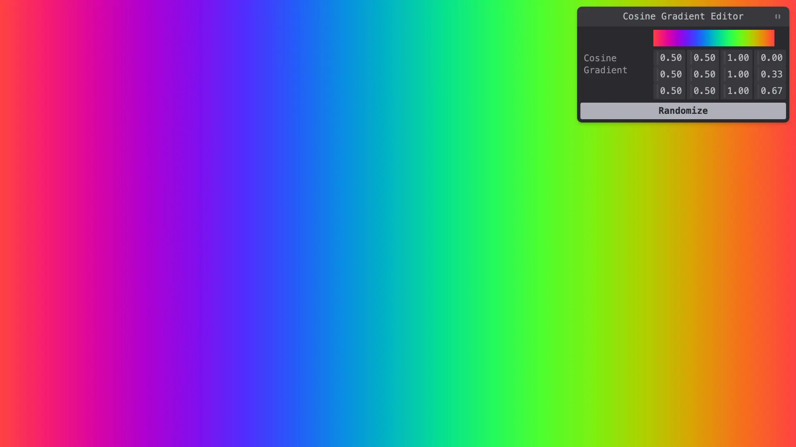

# tweakpane-plugin-cosine-gradient



Cosine gradient controls for [Tweakpane](https://github.com/cocopon/tweakpane/)

[DEMO](https://tweakpane-plugin-cosine-gradient.vercel.app/)

## Installation

```
npm install tweakpane-plugin-cosine-gradient
```

## Usage
```typescript
import {Pane} from 'tweakpane';
import * as CosineGradientPlugin from 'tweakpane-plugin-cosine-gradient';
import { CosineGradient, CosineGradientBladeApi } from 'tweakpane-plugin-cosine-gradient';

const pane = new Pane();
pane.registerPlugin(CosineGradientPlugin);

const toCSS = (cosineGradient:CosineGradient): string => {
    const steps = 16;
    const colorStops: string[] = [];
    for (let i = 0; i <= steps; i++) {
        const t = i / steps;
        const [r, g, b] = cosineGradient.Evaluate(t);
        colorStops.push(`rgb(${r}, ${g}, ${b}) ${Math.floor(t * 100)}%`);
    }
    return `linear-gradient(to right, ${colorStops.join(', ')})`;
}

const updateBackground = (gradient: CosineGradient) => {
    const css = toCSS(gradient);
    document.body.style.background = css;
}

const cosineGradient = new CosineGradient(
        [0.5, 0.5, 1.0, 0.0],
        [0.5, 0.5, 1.0, 0.33],
        [0.5, 0.5, 1.0, 0.67]
);

var cosineGradientBlade = pane.addBlade({
    label: 'Cosine Gradient',
    view: 'cosineGradient',
    defaultValue: cosineGradient,
}) as CosineGradientBladeApi;

cosineGradientBlade.on('change', (ev:TpChangeEvent<CosineGradient>) => {
    updateBackground(ev.value);
});

```
